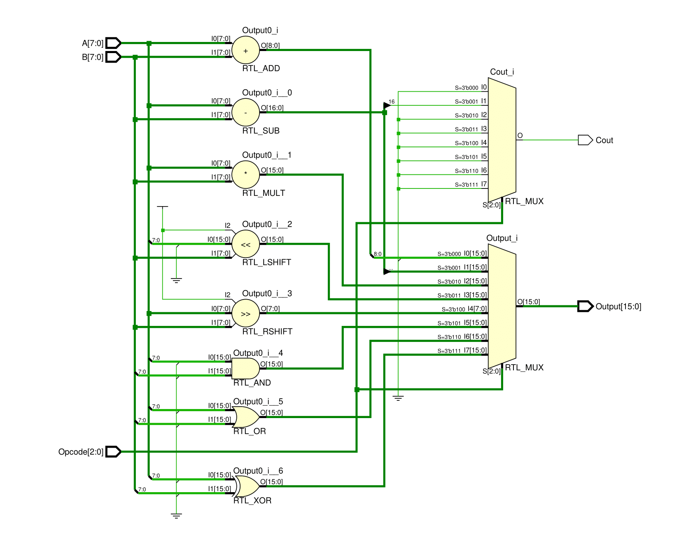
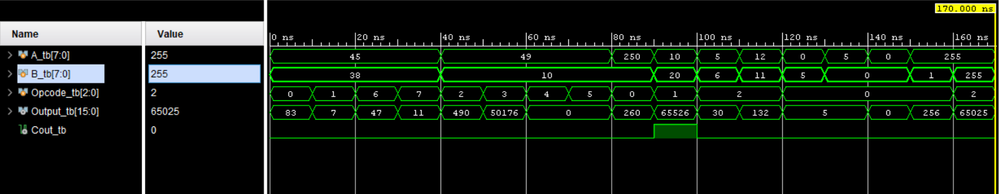

# 8-bit Arithmetic Logic Unit (ALU)

## Description

The capstone project is to implement an 8-bit Arithmetic Logic Unit (ALU) using Verilog. The ALU is capable of performing eight different operations based on the given opcode. The operations include arithmetic, logical, and shift functions. The design supports two 8-bit inputs and produces a 16-bit output to accommodate operations like multiplication.

All inputs and outputs are taked as unsigned integers.

---

## Features

The 8-bit ALU performs the following operations based on the 3-bit opcode:

| **Opcode** | **Operation**         | **Description**                                    |
|------------|-----------------------|----------------------------------------------------|
| `000`      | Addition              | Adds inputs `A` and `B` and outputs the result.    |
| `001`      | Subtraction           | Subtracts input `B` from `A` (`A - B`).            |
| `010`      | Multiplication        | Multiplies inputs `A` and `B`.                     |
| `011`      | Left Shift            | Shifts input `A` left by `B` position.             |
| `100`      | Right Shift           | Shifts input `A` right by `B` position.            |
| `101`      | Logical AND           | Performs bitwise AND operation between `A` and `B`.|
| `110`      | Logical OR            | Performs bitwise OR operation between `A` and `B`. |
| `111`      | Logical XOR           | Performs bitwise XOR operation between `A` and `B`.|

---
## Schematics
Below are some of the schematics developed during this project:

### 8 Bit ALU 


### 8 Bit ALU Simulation Output


## Project Structure

The project consists of the following Verilog modules:

1. **ALU_8_BIT**: The main ALU module implementing the logic for the operations.
2. **ALU_8_BIT_TB**: The testbench used to simulate and verify the functionality of the ALU.

---

## Input/Output Description

### Inputs:
- `Opcode` (3 bits): Specifies the operation to perform.
- `A` (8 bits): First operand.
- `B` (8 bits): Second operand.

### Outputs:
- `Output` (16 bits): Result of the operation.
- `Cout` (1 bit): Carry-out flag, used in addition and subtraction.

---

## Test Cases

### Case 1: Inputs `A = 45`, `B = 38`
- **Opcode = 000** (Addition): Output = `83`, Cout = `0`
- **Opcode = 001** (Subtraction): Output = `7`, Cout = `0`
- **Opcode = 110** (Logical OR): Output = `63`, Cout = `0`
- **Opcode = 111** (Logical XOR): Output = `7`, Cout = `0`

### Case 2: Inputs `A = 49`, `B = 10`
- **Opcode = 010** (Multiplication): Output = `490`, Cout = `0`
- **Opcode = 011** (Left Shift): Output = `50176`, Cout = `0`
- **Opcode = 100** (Right Shift): Output = `0`, Cout = `0`
- **Opcode = 101** (Logical AND): Output = `0`, Cout = `0`

---

## Usage Instructions

### Simulation
1. Clone this repository and open the project in your preferred Verilog simulation tool (e.g., ModelSim, Vivado).
2. Compile both `ALU_8_BIT` and `ALU_8_BIT_TB` modules.
3. Run the simulation using `ALU_8_BIT_TB` as the top module.
4. Observe the waveform or console output to verify functionality.

### Verification
The provided testbench tests all operations with the specified input cases. The `$monitor` statement in the testbench logs the opcode, inputs, and outputs for each operation.

---

## Example Simulation Output

```plaintext
Time:    0 | Opcode: 000 | A: 45 | B: 38 | Output: 83    | Cout: 0
Time:   10 | Opcode: 001 | A: 45 | B: 38 | Output: 7     | Cout: 0
Time:   20 | Opcode: 110 | A: 45 | B: 38 | Output: 63    | Cout: 0
Time:   30 | Opcode: 111 | A: 45 | B: 38 | Output: 7     | Cout: 0
Time:   40 | Opcode: 010 | A: 49 | B: 10 | Output: 490   | Cout: 0
Time:   50 | Opcode: 011 | A: 49 | B: 10 | Output: 50176 | Cout: 0
Time:   60 | Opcode: 100 | A: 49 | B: 10 | Output: 0     | Cout: 0
Time:   70 | Opcode: 101 | A: 49 | B: 10 | Output: 0     | Cout: 0
```
## File Descriptions
1. ALU_8_BIT.v: Implements the ALU functionality for all 8 operations.
2. ALU_8_BIT_TB.v: Contains the testbench code for simulating the ALU module.

## Future Enhancements
1. Support for additional operations like division and modulus.
2. Parameterize the module to support dynamic bit-widths for inputs and outputs.
3. Add overflow detection for arithmetic operations.