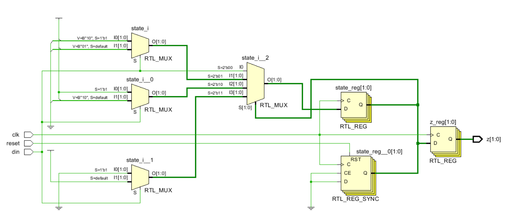
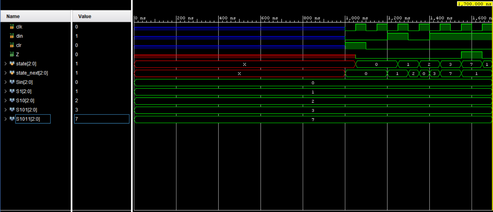
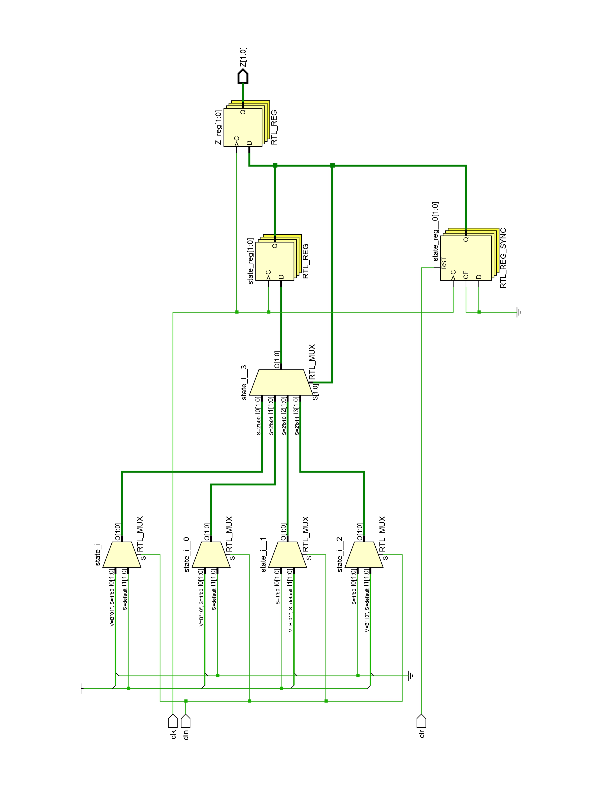
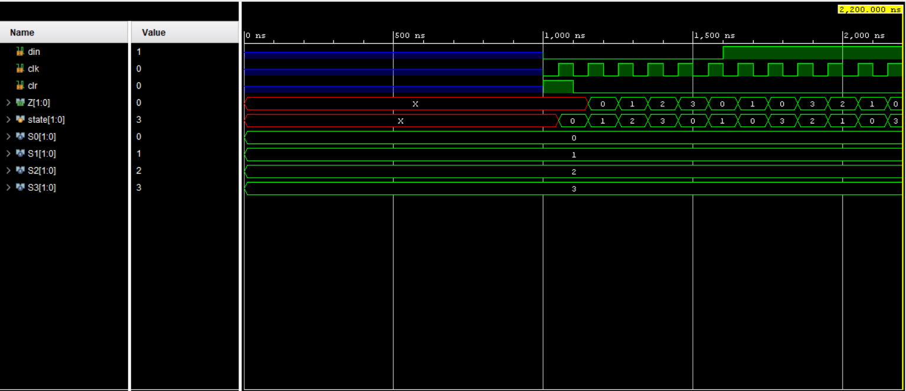
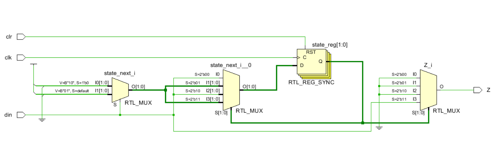
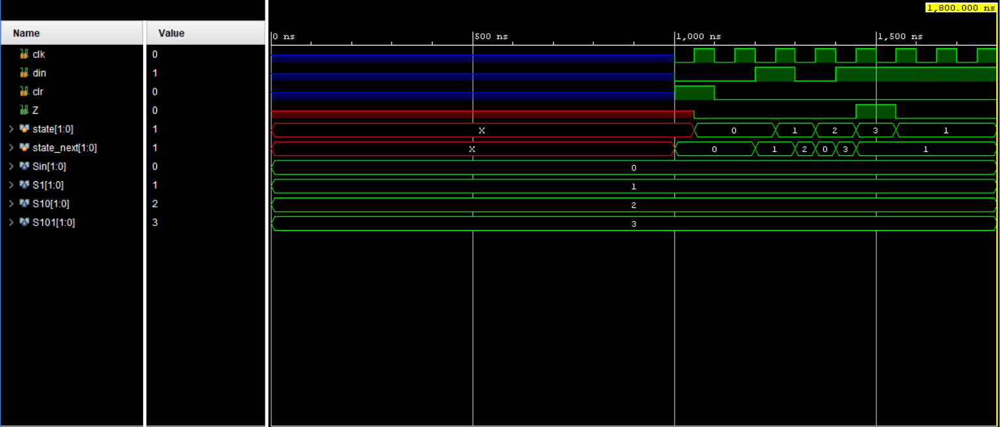
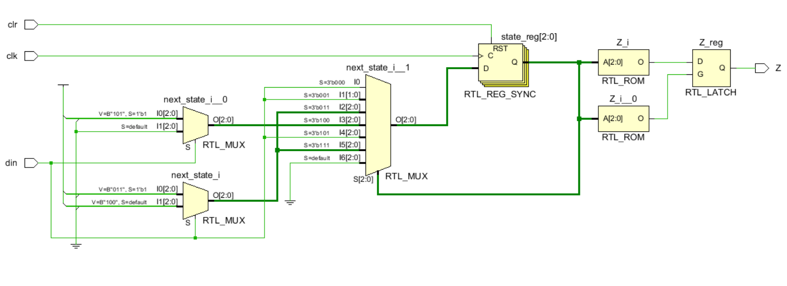
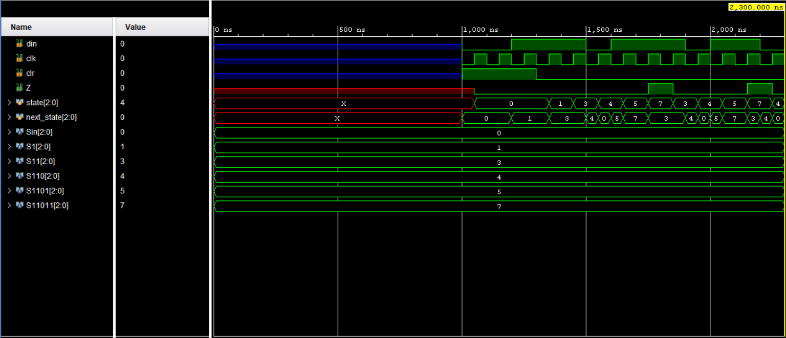

# Finite State Machine

This folder contains the schematics and simulated circuits developed during the **VLSI Design Course** using **Xilinx Vivado**. The folder `FSM` includes foundational concepts of sequential circuits concepts and their corresponding circuits.

## Overview
The project demonstrates various circuits simulated under **Xilinx Vivado** to build an understanding of combinantional circuitss.

## Schematics
Below are some of the schematics developed during this project:

### Finite State Machine (FSM) Counter


### FSM Counter Simulation Output


### FSM Pattern Recognition (Moore's Machine) 


### FSM Pattern Recognition Simulation Output (Moore's Machine) 


### FSM UpDown Counter (Mealy's Machine)


### FSM UpDown Counter Simulation Output (Mealy's Machine)


### FSM Pattern Recognition (Mealy's Machine)


### FSM Pattern Recognition Simulation Output (Mealy's Machine)


### FSM Pattern Recognition (Module Test - Recognise 11011) 


### FSM Pattern Recognition Simulation Output (Module Test - Recognise 11011) 



## Tools Used
- **Xilinx Vivado**
- HDL Coding (Verilog)

## How to Use
1. Clone the repository:
   ```bash
   git clone https://github.com/roguehunter7/VLSI-DESIGN-COURSE.git
   ```
2. Navigate to the `FSM` folder:
   ```bash
   cd VLSI-DESIGN-COURSE/FSM
   ```
3. Open the schematics using Xilinx Vivado or view the `.png` files in the `SCHEMATICS` folder.


