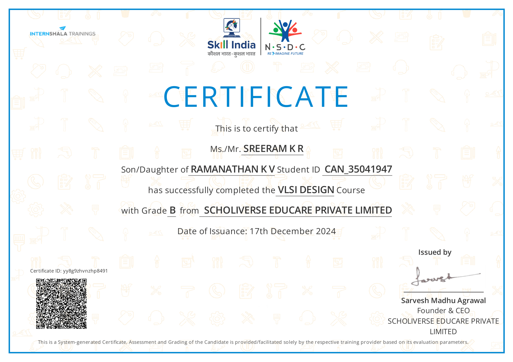

# VLSI Design Certification 🎓

Welcome to my **VLSI Design Certification** repository! This repository showcases my learning journey through the VLSI Design course. 

The course provides an in-depth understanding of VLSI design, covering essential topics like HDL coding, combinational and sequential circuit design, FPGA-based system design, and finite state machines.

---

## 📜 **About the Course**
This certification, offered by **IITM Pravartak** in collaboration with **NSDC** and **Internshala**, provided in-depth knowledge and hands-on experience in:

- **Introduction to VLSI**: Basic concepts of VLSI and its application in modern electronics.
- **HDL Coding Concepts**: Writing Verilog code for digital circuit design.
- **Combinational Circuits**: Design of basic combinational circuits like multiplexers and decoders.
- **Sequential Circuit Design**: Designing latches, flip-flops, and counters.
- **Finite State Machines**: Implementing FSMs for controlling sequential logic.
- **System Design using FPGA**: Using FPGAs for rapid prototyping and testing.
- **Case Studies & Final Project**: Real-world applications and a final project to design an 8-bit ALU.
---

## 🛠️ **Skills Demonstrated**
- **HDL (Verilog)**: Coding combinational and sequential circuits.
- **VLSI Design**: Designing, implementing, and simulating circuits like ALUs and FSMs.
- **FPGA Design**: Creating synthesizable designs and analyzing resource utilization.
- **Simulation & Debugging**: Using simulation tools to test functionality.

---
## 🚀 **Projects** Overview
### Capstone Project
#### **8-bit ALU Design**
An 8-bit Arithmetic Logic Unit (ALU) capable of performing basic arithmetic and logic operations. This project integrates concepts from combinational logic, registers, and control logic.
- [📂 View Project Files](8-Bit-ALU-Project/)

### Mini Projects

#### 1. **Traffic Light Controller**
This project demonstrates the design of a traffic light controller using Verilog. The design is implemented as a finite state machine (FSM) to control traffic flow.

#### 2. **Vending Machine**
A Verilog-based vending machine simulation that accepts coins, calculates totals, and dispenses products.

---

## 📄 **Certifications**
Upon completing this course, I have received training certifications from IIT Madras Pravartak, NSDC & Skill India, and Internshala Trainings: 

- **IITM Pravartak & NSDC Certification**: *"VLSI Design Certification"*  
    
  [📄 View Full Certificate](./Certificates/CAN_35041947_4516577-1.pdf)

- **Internshala Training Certificate**: *"Verilog Design"*  
    
  [📄 View Full Certificate](./Certificates/VLSI%20Design%20Training%20-%20Certificate%20of%20Completion-1.pdf)

---

## 🔧 **Technologies Used**
- **Verilog**: Hardware description language used to code the digital circuits.
- **FPGA**: Field-programmable gate arrays used for system prototyping.
- **Xilinx ISE/Vivado**: FPGA design tools for simulation and implementation.
- **Version Control**: Git & GitHub

---

## 👤 **About Me**
I am an aspiring **VLSI Engineer** with a strong passion for **digital design and system implementation**. Through this repository, I aim to showcase my dedication to learning and my ability to apply theoretical concepts to practical projects.  

🔗 **Connect with me**:  
- **Email**: krsreeram007@gmail.com  
- **LinkedIn**: [Sreeram K R](https://www.linkedin.com/in/sreeram-k-r/)  

---

## 📜 **License**
This repository is licensed under the [MIT License](LICENSE). You are free to use the resources in this repository for learning purposes. Proper attribution is appreciated!

---

Thank you for visiting my repository! Feel free to explore, and don't hesitate to reach out if you have any feedback or collaboration opportunities. 🚀