# Sequential Circuits

This folder contains the schematics and simulated circuits developed during the **VLSI Design Course** using **Xilinx Vivado**. The folder `SEQ_CIRCUITS` includes foundational concepts of sequential circuits concepts and their corresponding circuits.

## Overview
The project demonstrates various circuits simulated under **Xilinx Vivado** to build an understanding of combinantional circuitss.

## Schematics
Below are some of the schematics developed during this project:

### Set-Reset Latch


### Set-Reset Flip Flop
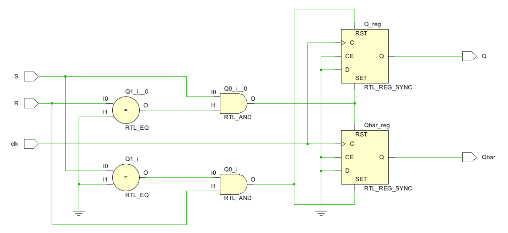

### Data Flip Flop
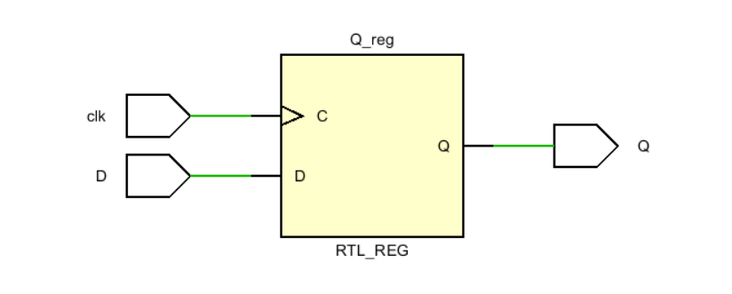

### Toggle Flip Flop
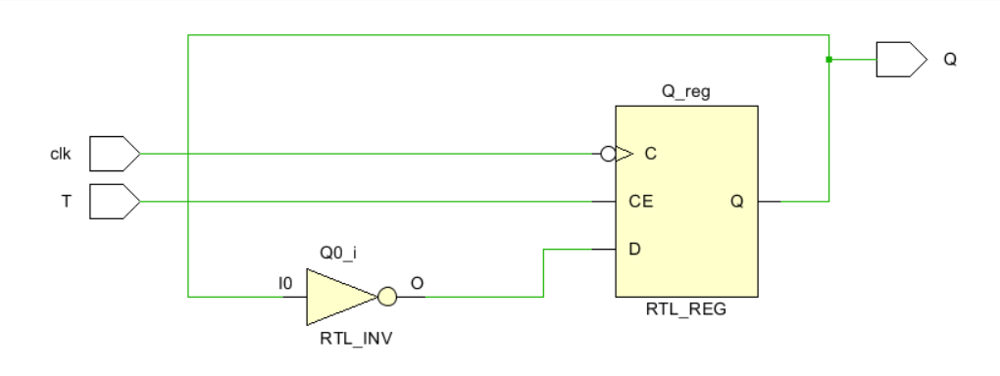

### JK Flip Flop
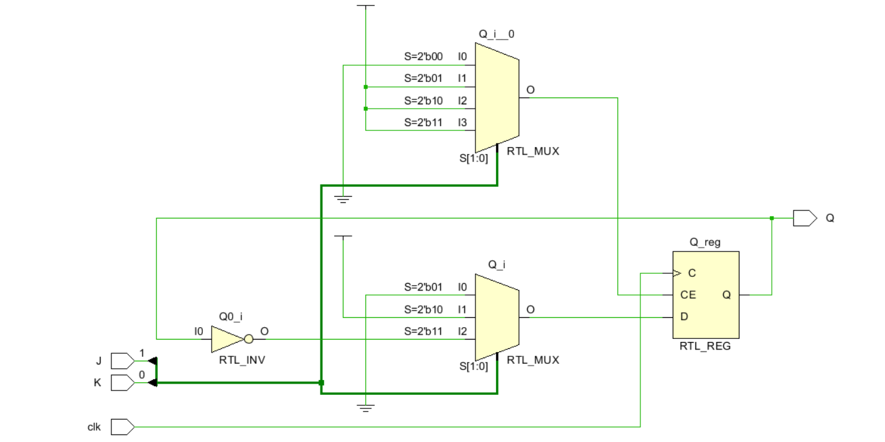

### Simple 4 Bit Register
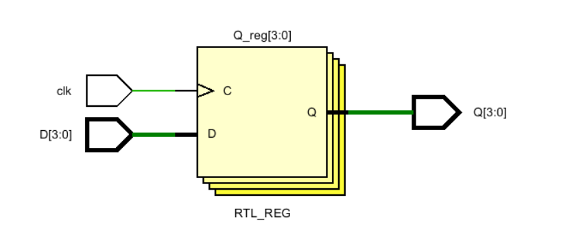

### 4 Bit Register using Flip Flops
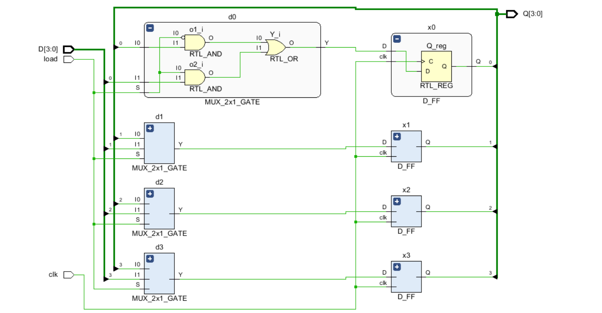

### 4 Bit Register with clear
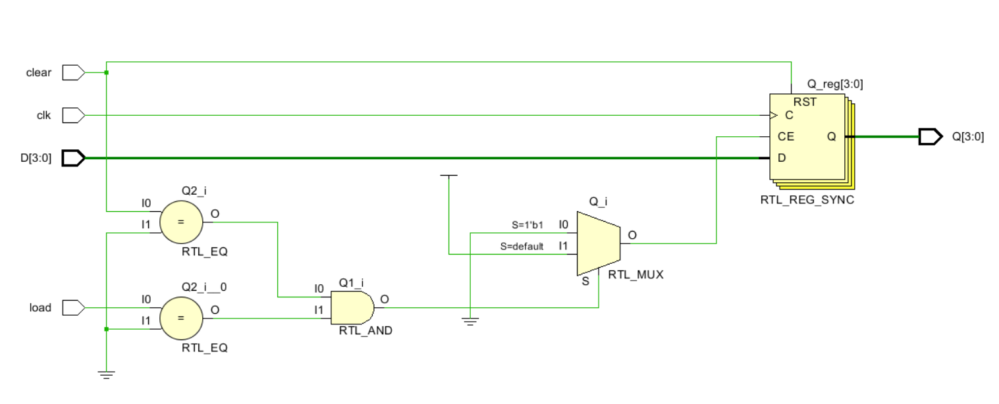

### 4 Bit PIPO Bi-Directional Shift Register
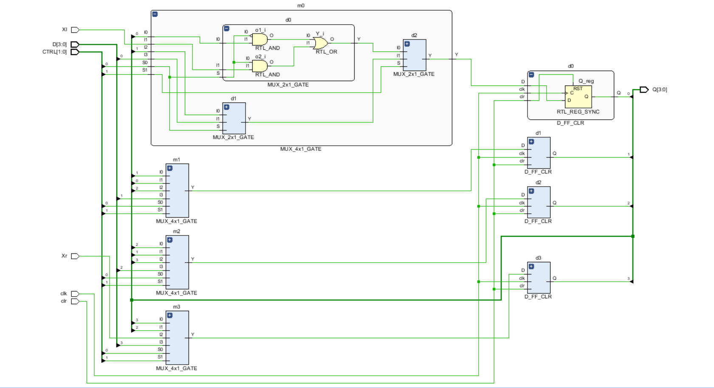

### 4 Bit SIPO Shift Register
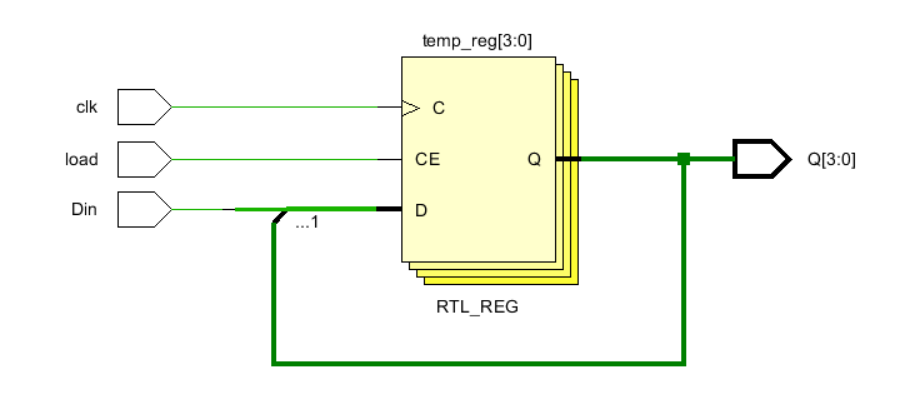

### 4 Bit Asynchronous Counter
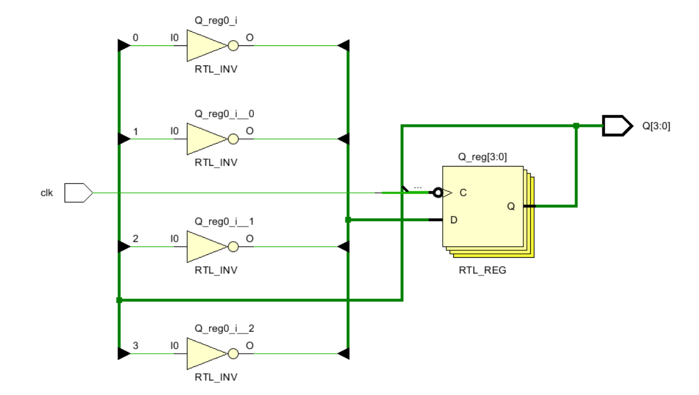

### 4 Bit Up Down Counter


### 4 Bit Ring Counter
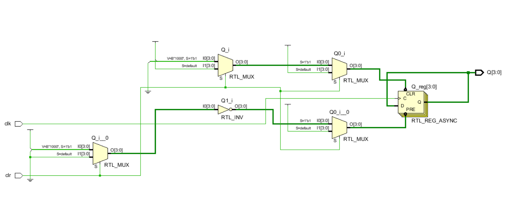

### 4 Bit Johnson Counter


## Tools Used
- **Xilinx Vivado**
- HDL Coding (Verilog)

## How to Use
1. Clone the repository:
   ```bash
   git clone https://github.com/roguehunter7/VLSI-DESIGN-COURSE.git
   ```
2. Navigate to the `SEQ_CIRCUITS` folder:
   ```bash
   cd VLSI-DESIGN-COURSE/COMBI_CIRCUITS
   ```
3. Open the schematics using Xilinx Vivado or view the `.png` files in the `SCHEMATICS` folder.


