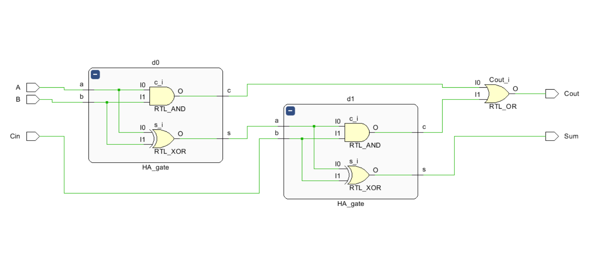
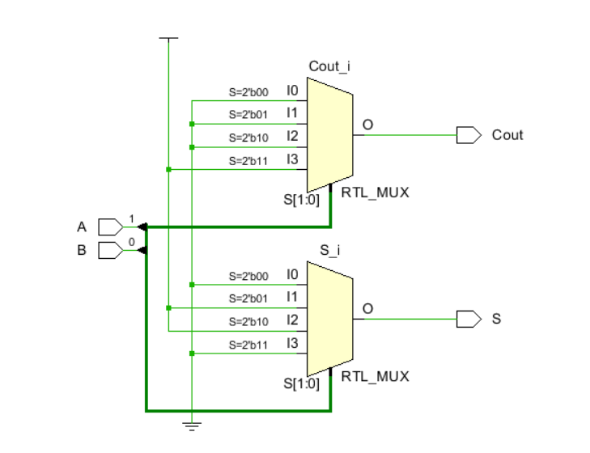
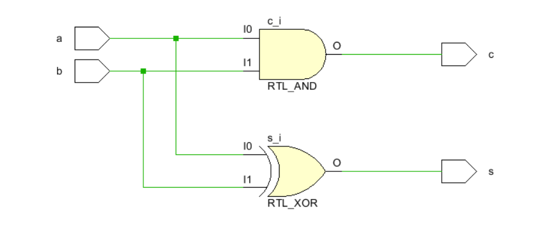
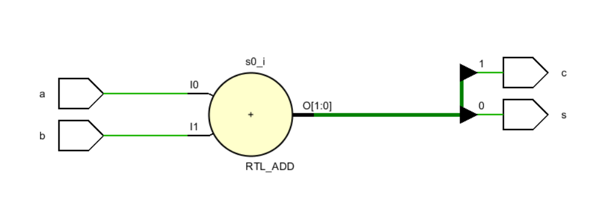
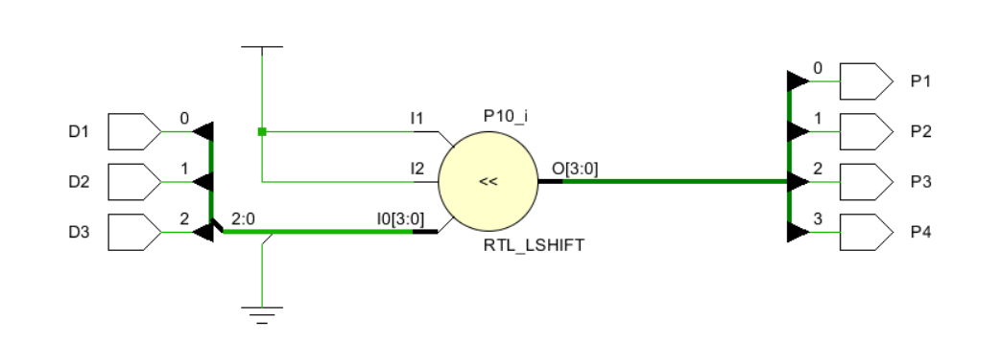

# VLSI DESIGN COURSE

This folder contains the schematics and simulated circuits developed during the **VLSI Design Course** using **Xilinx Vivado**. The folder `project_1` includes foundational concepts of HDL coding and their corresponding circuits.

# Basic HDL Coding Concepts Circuits

## Overview
The project demonstrates various circuits simulated under **Xilinx Vivado** to build an understanding of HDL coding concepts.

## Schematics
Below are some of the schematics developed during this project:

### Full Adder Using Module Instantiation


### Half Adder Using Case Statements


### Half Adder Using Gates


### Half Adder Using Dataflow Modelling


### Module Test



## Tools Used
- **Xilinx Vivado**
- HDL Coding (VHDL/Verilog)

## How to Use
1. Clone the repository:
   ```bash
   git clone https://github.com/roguehunter7/VLSI-DESIGN-COURSE.git
   ```
2. Navigate to the `project_1` folder:
   ```bash
   cd VLSI-DESIGN-COURSE/project_1
   ```
3. Open the schematics using Xilinx Vivado or view the `.png` files in the `SCHEMATICS` folder.


